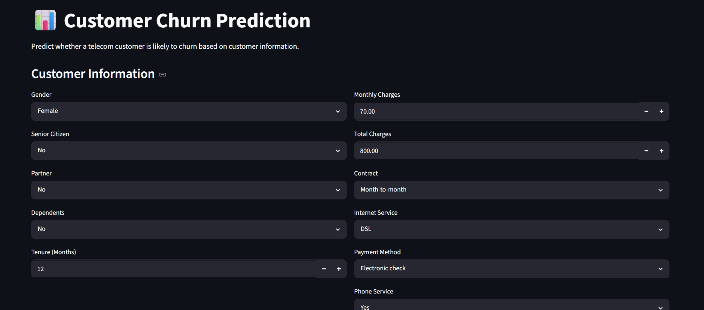
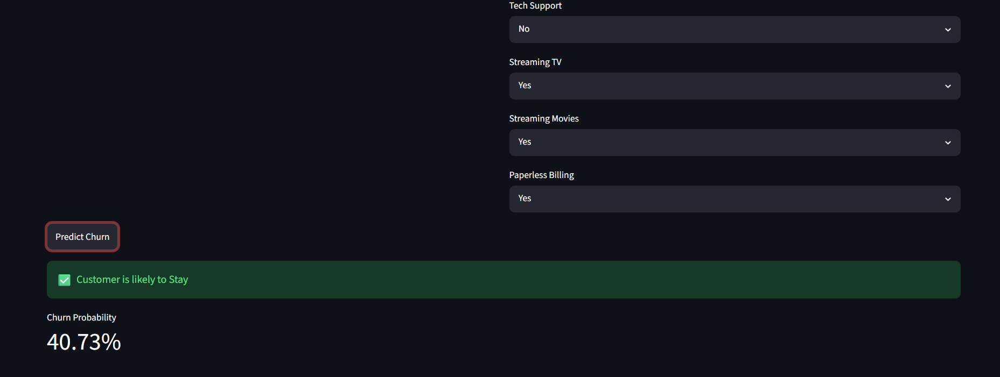
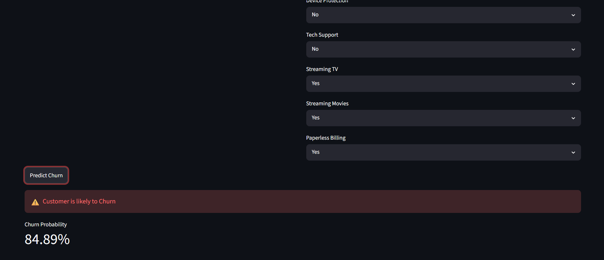

# 📊 Customer Churn Prediction using Machine Learning

A complete end-to-end Machine Learning project that predicts whether a telecom customer is likely to churn based on customer demographics, account information, subscribed services, and billing details.

The project follows an industry-standard machine learning workflow, including data preprocessing, exploratory data analysis, feature engineering, model development, evaluation, model persistence, and deployment using Streamlit.

---

## 🚀 Live Demo

**Streamlit App:** *(Add your deployed Streamlit URL here after deployment)*

---

## 📌 Project Overview

Customer churn is one of the biggest challenges faced by subscription-based businesses. Accurately identifying customers who are likely to leave enables companies to improve customer retention through targeted interventions.

This project develops a binary classification model to predict customer churn using supervised machine learning techniques.

---

## 🎯 Objectives

- Predict customer churn with high accuracy
- Identify important customer attributes influencing churn
- Build a reusable machine learning pipeline
- Deploy the model as an interactive Streamlit web application

---

## 📂 Dataset

**Dataset:** Telco Customer Churn Dataset

The dataset contains customer demographic information, subscribed telecom services, billing details, and churn status.

### Features include:

- Gender
- Senior Citizen
- Partner
- Dependents
- Tenure
- Phone Service
- Multiple Lines
- Internet Service
- Online Security
- Online Backup
- Device Protection
- Tech Support
- Streaming TV
- Streaming Movies
- Contract Type
- Paperless Billing
- Payment Method
- Monthly Charges
- Total Charges

Target Variable:

- **Churn (Yes / No)**

---

## ⚙️ Tech Stack

### Programming

- Python

### Libraries

- Pandas
- NumPy
- Scikit-learn
- Matplotlib
- Seaborn
- Joblib
- Streamlit

### Development Tools

- VS Code
- Jupyter Notebook
- Git
- GitHub

---

## 📁 Project Structure

```text
Customer-Churn-Prediction/
│
├── app/
│   └── app.py
│
├── data/
│   ├── raw/
│   └── processed/
│
├── models/
│   ├── logistic_regression.pkl
│   └── scaler.pkl
│
├── notebooks/
│   ├── 01_data_loading.ipynb
│   ├── 02_data_cleaning.ipynb
│   ├── 03_exploratory_data_analysis.ipynb
│   ├── 04_feature_engineering.ipynb
│   ├── 05_model_building.ipynb
│   ├── 06_model_evaluation.ipynb
│   ├── 07_model_interpretation.ipynb
│   └── 08_streamlit_testing.ipynb
│
├── reports/
│   └── figures/
│
├── requirements.txt
├── README.md
└── LICENSE
```

---

## 🔄 Machine Learning Workflow

### 1. Data Loading

- Imported dataset
- Inspected data types
- Checked missing values

---

### 2. Data Cleaning

- Removed inconsistencies
- Converted data types
- Handled missing values

---

### 3. Exploratory Data Analysis

- Distribution analysis
- Correlation analysis
- Churn analysis
- Feature visualization

---

### 4. Feature Engineering

- One-Hot Encoding
- Feature Selection
- Standard Scaling
- Train-Test Split

---

### 5. Model Building

Implemented Logistic Regression classifier using Scikit-learn.

Model pipeline includes:

- StandardScaler
- Logistic Regression
- Model serialization using Joblib

---

### 6. Model Evaluation

Performance Metrics:

- Accuracy
- Precision
- Recall
- F1 Score
- ROC-AUC Score
- Confusion Matrix
- ROC Curve

---

## 📈 Model Performance

| Metric | Score |
|---------|--------|
| Accuracy | **76.83%** |
| Precision | **58%** |
| Recall | **48%** |
| F1 Score | **52%** |
| ROC-AUC | **0.8319** |

---

## 💻 Streamlit Application

The deployed application allows users to:

- Enter customer information
- Predict customer churn instantly
- View churn probability
- Receive an easy-to-understand prediction result

---

## 📷 Application Screenshots

### Home Page



### Customer Likely to Stay



### Customer Likely to Churn




## ▶️ Installation

Clone the repository

```bash
git clone https://github.com/<your-github-username>/Customer-Churn-Prediction.git
```

Move into the project directory

```bash
cd Customer-Churn-Prediction
```

Create virtual environment

```bash
python -m venv venv
```

Activate virtual environment

Windows

```bash
venv\Scripts\activate
```

Install dependencies

```bash
pip install -r requirements.txt
```

Run the Streamlit application

```bash
streamlit run app/app.py
```

---

## 🔮 Future Improvements

- XGBoost and Random Forest implementation
- Hyperparameter tuning
- Model explainability using SHAP
- Cross-validation
- Cloud deployment
- Docker containerization

---

## 📚 Key Skills Demonstrated

- Data Cleaning
- Exploratory Data Analysis
- Feature Engineering
- Machine Learning
- Classification
- Model Evaluation
- Feature Scaling
- Model Serialization
- Streamlit Deployment
- Git Version Control

---

## 👩‍💻 Author

**Ishika Gupta**

B.Tech Mechanical Engineering  
PDPM IIITDM Jabalpur

GitHub:
https://github.com/ishikagup26/Customer-Churn-Prediction

LinkedIn:
https://www.linkedin.com/in/ishika-gupta-5a29b4289/

---

## ⭐ If you found this project useful, consider giving it a Star!